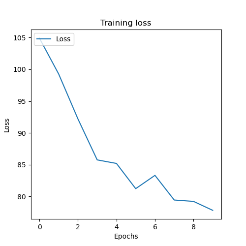

## plan
See if you can train a embedding model for shellcode

Based off ideas from [Text and Code Embeddings by Contrastive Pre-Training](https://cdn.openai.com/papers/Text_and_Code_Embeddings_by_Contrastive_Pre_Training.pdf)

### demo
```
python3 train.py
```



```
python3 train.py
```

Then you get a simple web interface to explore the embeddings with the code. It worked supinely well for a first iteration.


