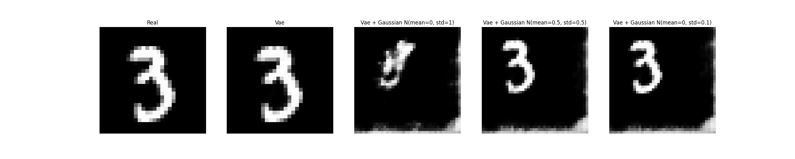

From the [OpenAI Requests for Research 2.0](https://openai.com/research/requests-for-research-2)

Use a VAE to learn the data augmentation with gaussian noise.

Mainly I want to observe the affect of applying gaussian to the latent space on the decode output.

I love foundation models.

## Example
~~The noise moves the elements (which is cool), but it doesn't seem to move much depending on the parameters of the noise.~~
Multiplying instead of adding to the noise yielded more interesting results.

I guess we could train another network GAN like to know how to adjust the latent parameters.
