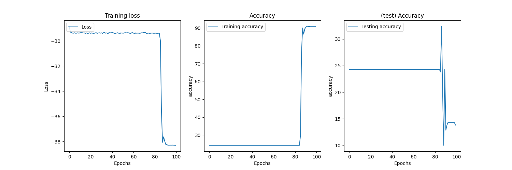
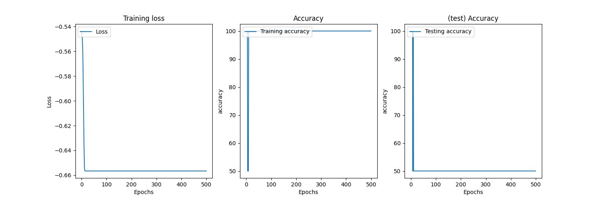
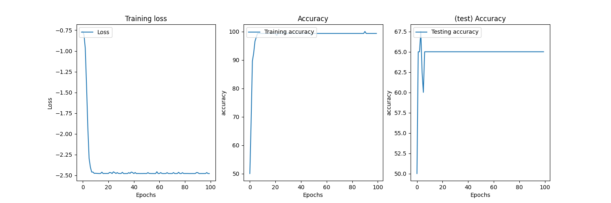
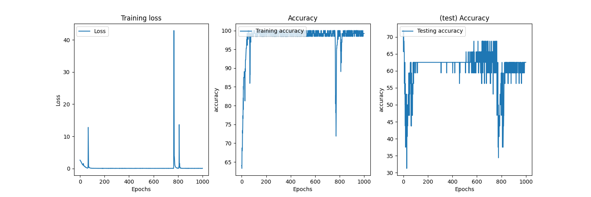

Testing and training various ranking algorithms, still wip.

(the dataset is still quite small, I'm labeling it myself ... )

Running the hosted model.
```bash
python3 run_rankmodel.py
```

## Listrank list


## Listrank 


## Boltzrank 


## Ranknet 

