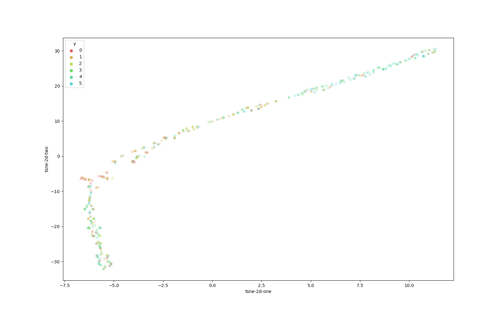

When I find a song I put it in `songs that has to be relocated`, and then later organize it. Ideally this should happen automatically.

## Goal
- Create a web service that talks to https://github.com/2xic-speedrun/wirehead/ to get song features
- Cluster them to playlist
- Reorganize the playlist, or at least give suggestions with a simple frontend

## Results

Super simple frontend, but it helped me organize the playlist :) The select option will be automatically set to the model prediction of the target playlist, but user can also override this. Move song naturally moves the song, but the user can also listen to the song if they have to recall it.
Tested with some basic models and got around 60% accuracy on the test dataset, enough to speed up the organization.

-----

- Tried to plot the t-sne and pca feature vectors, but was no obvious separation points (see images)
- Tried to see what feature is the most important and it seems to be `tempo` for me. Makes sense.
- What is interesting is that even these simple models are able to correctly place some norwegian songs to my norwegian only playlist (none of the audio features specify country).

## features viz

