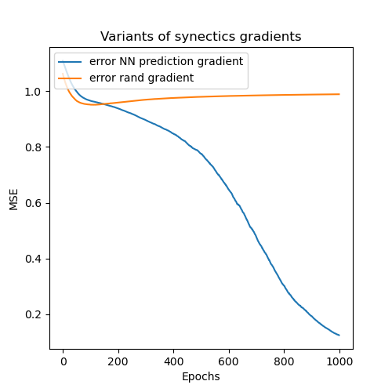

### [Decoupled Neural Interfaces using Synthetic Gradients](https://arxiv.org/pdf/1608.05343.pdf)

## Paper notes
- Forward and backwards propagation requirers networks to be locked while updating weights
  - To break this constraint they use a model to simulate backpropagation based on local information
    -  i.e model error gradients 
-  There are many forms of "locking" in a traditional NN design
    - Forward 
        -> Current layer needs previous layer input
        -> No layer can be updated before all have propagate forward
    - Backward 
      - -> Need next layers error to compute current error
- The goal of the paper is to remove the locking by approximating backpropagation
    - This is done by having a decoupled neural interface (termed by the paper)
    - When a layer sends a message (activations) to another layer there is an associated model to predict the synthetic gradient
      - This is a function of the message alone

### How it works
- Layer 1 passed it's activation ot Layer 2
  - Layer 2 has a model of Layer 1 and can use it's model to calculate the gradient
    - This is trained on approximating the real gradient while training the rest of the model
  - This is then available to Layer 1
  - The update rule then becomes
    - \theta_m = \theta_m + \alhpa * synthetic_gradient(local data)
    - And to train the model of the gradients one has to wait for a full forward propagation
      - But then .... what is the point ?
    - 
    - 

### Similar papers
- [Meta Learning Backpropagation And Improving It](https://arxiv.org/pdf/2012.14905.pdf)
  - They use a RNN for learning to meta learn the backward propagation

