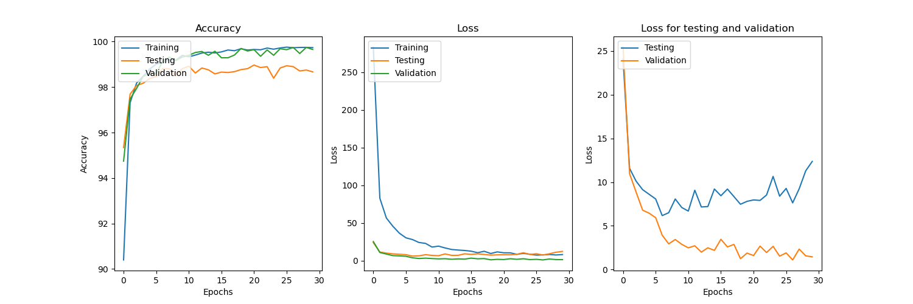

Early stopping, you can stop early when the validation loss stops improving and win.

We can see we were told to stop after epoch 17 which seems like a good idea. Shortly after that we started to overfit a bit on the test dataset.



```
epoch: 0, loss: 283.41180419921875, best_val loss inf at epoch -1
epoch: 1, loss: 82.95738983154297, best_val loss 25.44072914123535 at epoch 0
epoch: 2, loss: 56.71403121948242, best_val loss 10.963920593261719 at epoch 1
epoch: 3, loss: 45.72875213623047, best_val loss 8.863322257995605 at epoch 2
epoch: 4, loss: 36.54464340209961, best_val loss 6.795154571533203 at epoch 3
epoch: 5, loss: 30.42869758605957, best_val loss 6.444784164428711 at epoch 4
epoch: 6, loss: 28.123207092285156, best_val loss 5.93436861038208 at epoch 5
epoch: 7, loss: 24.22779655456543, best_val loss 3.9292550086975098 at epoch 6
epoch: 8, loss: 23.042959213256836, best_val loss 2.939152956008911 at epoch 7
epoch: 9, loss: 18.18521499633789, best_val loss 2.939152956008911 at epoch 7
epoch: 10, loss: 19.379375457763672, best_val loss 2.939152956008911 at epoch 7
epoch: 11, loss: 16.990266799926758, best_val loss 2.4849917888641357 at epoch 10
epoch: 12, loss: 14.949014663696289, best_val loss 2.4849917888641357 at epoch 10
epoch: 13, loss: 14.194182395935059, best_val loss 1.994336724281311 at epoch 12
epoch: 14, loss: 13.646807670593262, best_val loss 1.994336724281311 at epoch 12
epoch: 15, loss: 12.665752410888672, best_val loss 1.994336724281311 at epoch 12
epoch: 16, loss: 10.670689582824707, best_val loss 1.994336724281311 at epoch 12
epoch: 17, loss: 12.577813148498535, best_val loss 1.994336724281311 at epoch 12
We have moved past the optimal space ... we could stop here
....
(we continued to train to show a nice plot of the effect)
```
