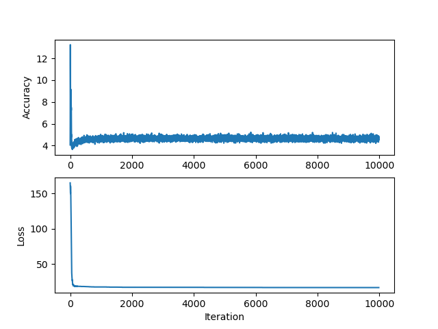

# [The Forward-Forward Algorithm: Some Preliminary Investigations](https://www.cs.toronto.edu/~hinton/FFA13.pdf)

## Results
Was able to get it to converge on a XOR like toy problem

Have some more difficulties getting it to work reliable on MNIST. It seems to spike, and then never able to recover. Might just be that it need more time.
- Tried to play around with the learning rate, and the model seems sensitive to this
- Tried to add a dropout layer which also seemed to help with bootstrapping, but then again fail

## Notes
- Replaces forward and backward passes with two forward passes
  - One with real data
  - One with fake data
- Each layer has it's own objective function    
  - Based on ideas
    - https://arxiv.org/abs/1809.01812
    - https://www.cs.toronto.edu/~fritz/absps/cogscibm.pdf
  - Which is simply to have high score when positive data, and low score with negative data
    - Objective function could i.e sum of squared activities in the layer
    - P(positive) = sigma(
        sum(y_j ** 2 - theta) 
      )
      - Theta is threshold
      - y_j is activity of hidden unit
      - sigma = logistic function
        - i.e sigmoid
  -  "FF normalizes the length of the hidden vector before using it as input to the next layer"
     -  layer normalization
  -  

**Update from 2023**

There is also [this](https://medium.com/@Mosbeh_Barhoumiforward-forward-algorithm-ac24d0d9ffd) medium post which is quite nice. 

[ The Forward-Forward Algorithm (video) ](https://www.youtube.com/watch?v=F7wd4wQyPd8)
- Cost function is moved to the layers and not at the end of the network (also noted above)
- **Use layer norm**

[ Extending the Forward Forward Algorithm (video) ](https://www.youtube.com/watch?v=hl6uD0mXMAw)
- They manipulate the threshold 
- They also tested it on IMDb dataset (NLP task)

