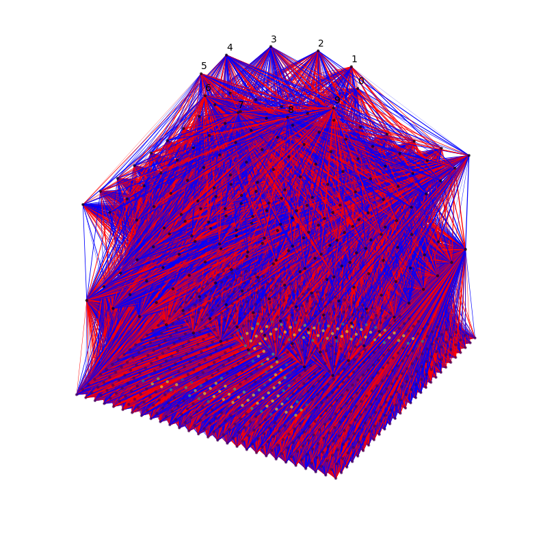
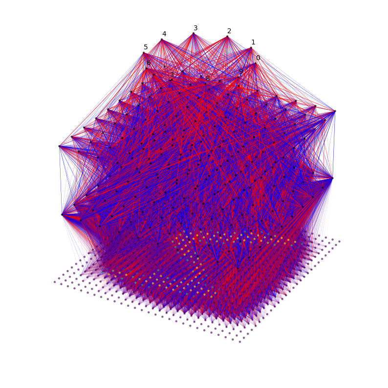

### [Seeing is Believing: Brain-Inspired Modular Training for Mechanistic Interpretability](https://arxiv.org/abs/2305.08746)

**Note: This is not a full implementation of the paper, it's mostly a playground version**

Originally thought this was a new architecture, but it's mostly techniques to create more sparse neural networks.

They discuss the usage of three different methods to get more sparsity. 
- They move the network into a 2d euclidean space to apply various regularization techniques
- They swap neurons

|           Untrained           |         Trained*          |
| :---------------------------: | :-----------------------: |
|  |  |

* it is not trained with all the techniques from the the paper
