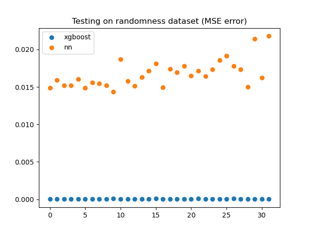

## What
Experiment tests how a simple neural network vs xgboost handles a simple function mapping (X, y, f(x, y)). 

## Why
Interesting to see how they handle it. NN are known for not handling tabluar data very well.

See [this](./why_do_tree-based_models_still_outperform_deep_learning_on_tabular_data.md) paper for more

## Result

