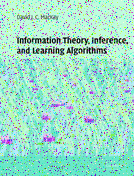
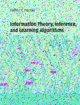

The first chapter is on how to communicate over noisy channels. The example case is that we have a noisy disk drive and there are generally two approaches on how to deal with this, we could either improve the quality of the disk drive or we could solve it with information theory (error correcting codes to be more precise).

Example image we are transferring with bit flips (f = 0.1)

Starting with one approach using a majority of votes method by repeating the same symbol multiple times. This works fine, but 

Then we look at block codes / hamming codes that look at sequences of bits to create a code. This makes the decoding part a bit more tricky as any of the parity bits can also now be flipped. 
Something is likely off with my implementation as the hamming codes should be more efficient at this task.

