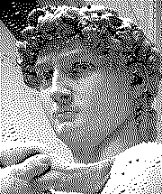

### [ How to shuffle songs? ](https://engineering.atspotify.com/2014/02/how-to-shuffle-songs/)

Spotify originally used Fisher–Yates shuffle to randomly shuffle playlist, but moved to a Floyd–Steinberg dithering like algorithm to have more "random" playlists.

## Plots

|            Image             |          Random    dithering       |     Floyd steinberg dithering      |
| :--------------------------: | :-----------------------: | :--------------------------------: |
|  |  |  |

