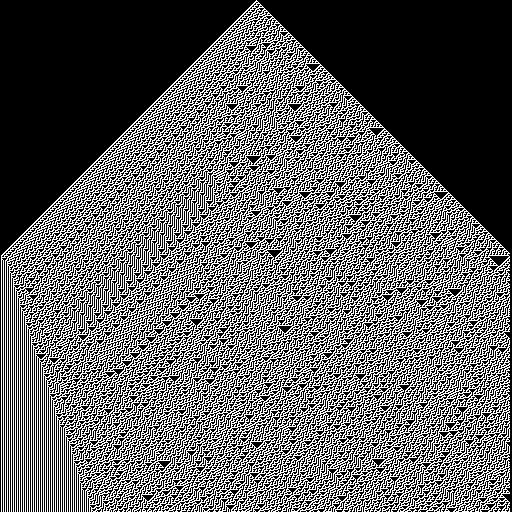

# [Rule 30](https://en.wikipedia.org/wiki/Rule_30)

Supposedly used as a [PRNG](https://en.wikipedia.org/wiki/Rule_30#Random_number_generation) also. Special rule, very good.

## Resources
- [ Wolfram's Rule 30 Cellular Automaton](http://www.jgiesen.de/rule30/index.html)
- [A new kind of science](https://www.wolframscience.com/nks/)
- [Cellular_automaton](https://en.wikipedia.org/wiki/Cellular_automaton)

