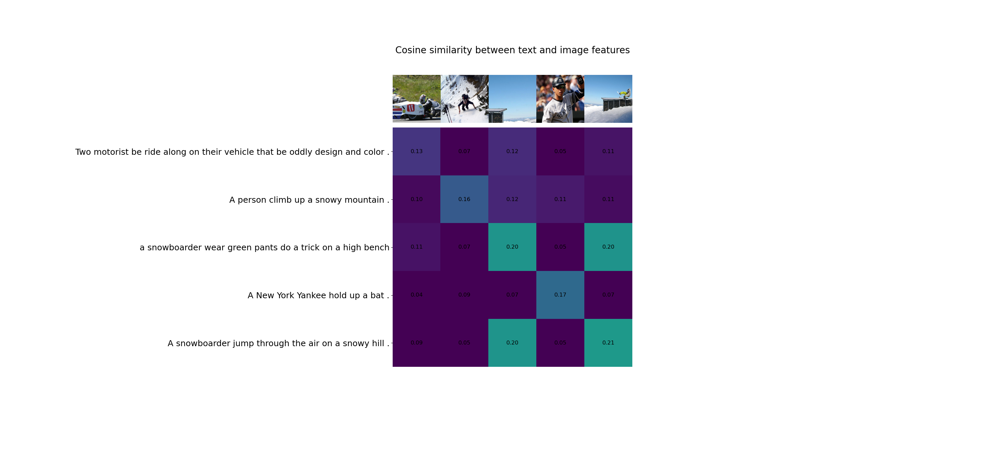

# Contrastive language image- pre-training (CLIP)



# [Blog post](https://openai.com/blog/clip/)
The network does not directly optimize for a given benchmark, and as a result it gains improved capabilities over other existing methods. It' has shown ot be capable of "zero-shot" learning like with GPT models.

In the blogpost they mention [Learning Visual N-Grams from Web Data](https://openaccess.thecvf.com/content_ICCV_2017/papers/Li_Learning_Visual_N-Grams_ICCV_2017_paper.pdf) that one could zero-shot imagenet with 11.5% accuracy from 30 millions Flickr photos.

The approach: given an image, the model should output what text was paired with the image. The model is trained by using contrastive pre-training.

This allows for zero-shot training, the model can for instance be used as a dog / cat classifier by seeing if it outputs "photo of dog/cat".


# [Paper](https://arxiv.org/pdf/2103.00020.pdf)

From figure 3. in the paper the pseudo code is described as
```python
    # image_encoder - ResNet or Vision Transformer
    # text_encoder - CBOW or Text Transformer
    # I[n, h, w, c] - minibatch of aligned images
    # T[n, l] - minibatch of aligned texts
    # W_i[d_i, d_e] - learned proj of image to embed
    # W_t[d_t, d_e] - learned proj of text to embed
    # t - learned temperature parameter
    # extract feature representations of each modality
    I_f = image_encoder(I) #[n, d_i]
    T_f = text_encoder(T) #[n, d_t]
    # joint multimodal embedding [n, d_e]
    I_e = l2_normalize(np.dot(I_f, W_i), axis=1)
    T_e = l2_normalize(np.dot(T_f, W_t), axis=1)
    # scaled pairwise cosine similarities [n, n]
    logits = np.dot(I_e, T_e.T) * np.exp(t)
    # symmetric loss function
    labels = np.arange(n)
    loss_i = cross_entropy_loss(logits, labels, axis=0)
    loss_t = cross_entropy_loss(logits, labels, axis=1)
    loss = (loss_i + loss_t)/2
```
