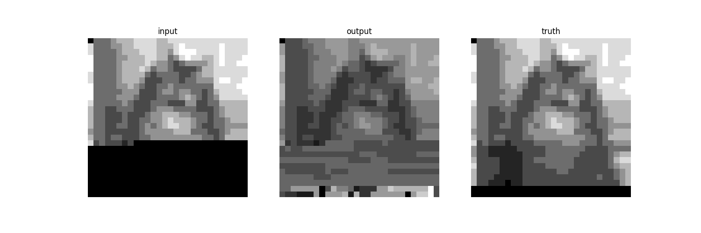
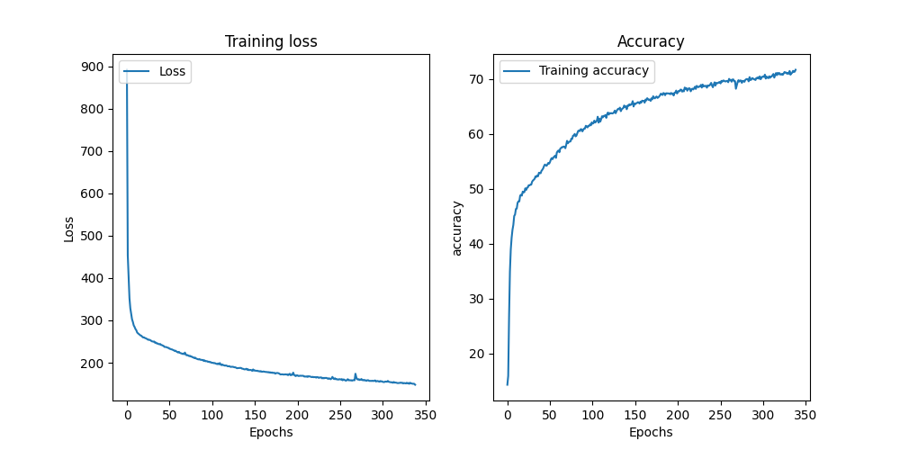

### [Generative Pretraining from Pixels](https://cdn.openai.com/papers/Generative_Pretraining_from_Pixels_V2.pdf)

### [old notes with old gpt implementation]
Currently does not give the best results even if the accuracy and loss curves are going in the right direction.

- Note that OpenAI uses a model with "6.8B parameters" which is 1000x what we trained on :) (we had around 2 million parameters for the results above)
- Looked some more distributed model training and got it up to 433.906701 million parameters. So now we are only 10x away :) 
- ^ I still don't see the results I was expecting so might be a bug with the implementation.

## Thanks to
- https://github.com/teddykoker/image-gpt/ which helped me spot issues with the previously used  gpt implementation

