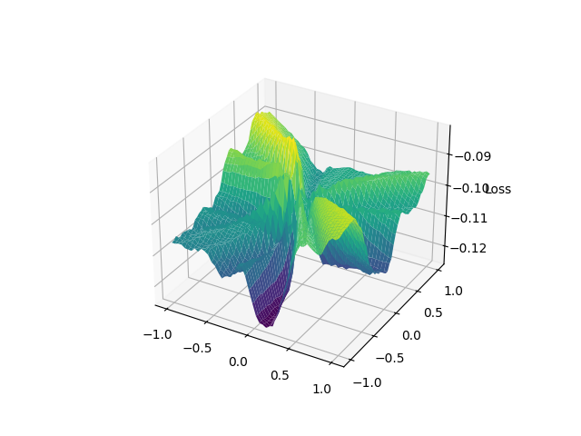

## Deep Residual Learning for Image Recognition

https://arxiv.org/pdf/1512.03385.pdf

### Results

|                 Testing accuracy                 |                 Training accuracy                 |                 Loss                 |
| :----------------------------------------------: | :-----------------------------------------------: | :----------------------------------: |
|  |  |  |

## Plot curve
I tried to reproduce the loss landscape with / without skip connections ([paper](https://arxiv.org/pdf/1712.09913)) 

Didn't fully work, but you get the idea.

|         No skip connection          |         Skip connection          |
| :---------------------------------: | :------------------------------: |
|  |  |

