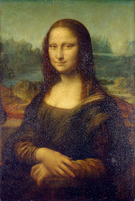
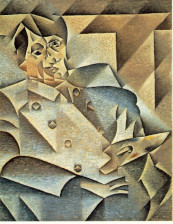
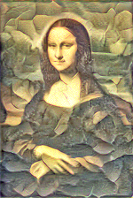
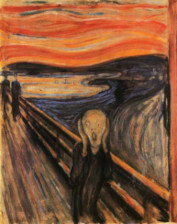
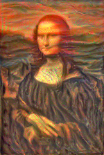

|            Content             |          Style       |     Output      |
| :--------------------------: | :-----------------------: | :--------------------------------: |
|  |  |  |
|  |  |  |

## Style transfers with vgg19
- One input style image
- One input content image
- One output image 

Optimization of the output image (note that it is not learning going on, but you optimize the input image)
- one of the losses is checking how the initially random output image have similar content as the inputs. This is basically the MSE between thw images at a layer L.
- the style transfer is a bit more tricky and involves looking at the correlation between the features maps. 

Idea works similarly to the [the fast gradient method](/architecture/uncertainty-estimation/fast-gradient-method) used for adversarial attacks. It is also used in a similar way to [visualize](https://blog.research.google/2015/06/inceptionism-going-deeper-into-neural.html?m=1). 

## Links
- https://github.com/leongatys/PytorchNeuralStyleTransfer <- Reference implementation I think, https://discuss.pytorch.org/t/pytorch-tutorial-for-neural-transfert-of-artistic-style/336/20?u=alexis-jacq
  