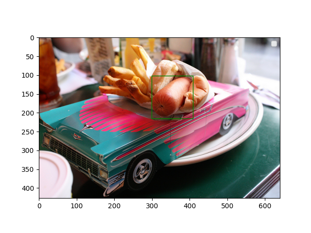
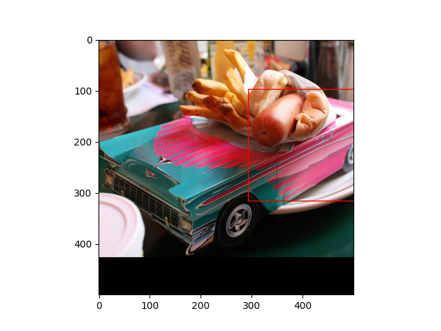
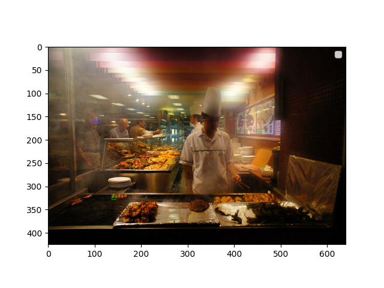
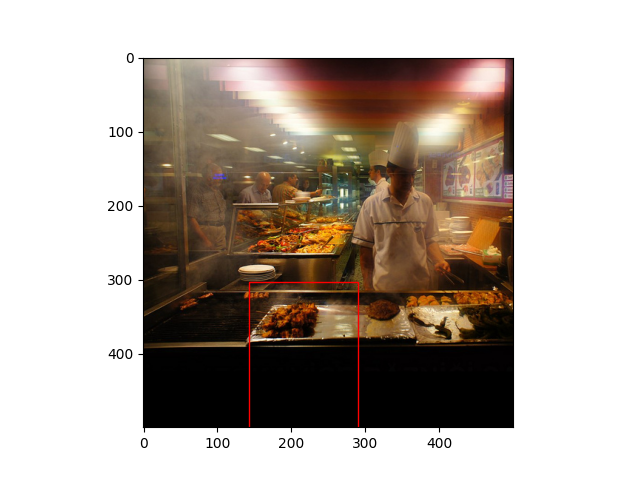
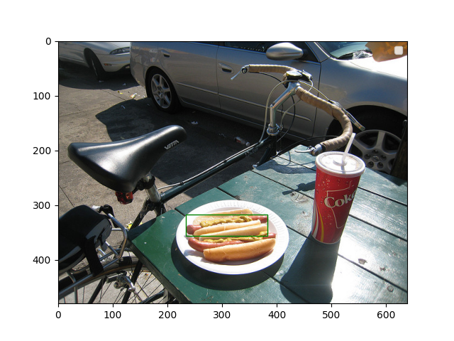
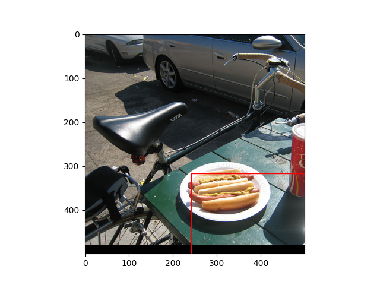
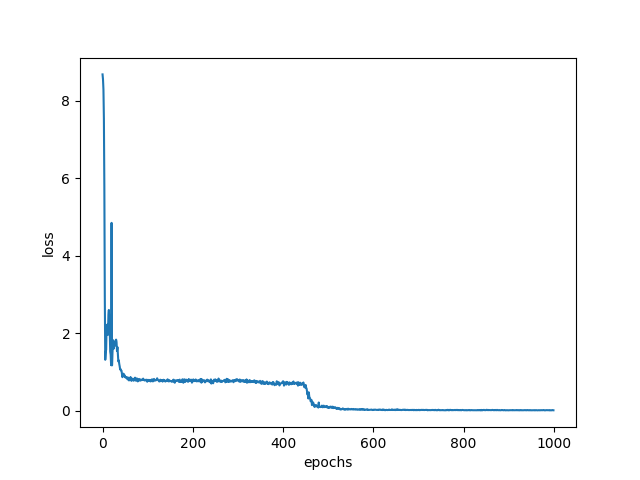

## [You Only Look Once](https://arxiv.org/pdf/1506.02640.pdf)

This is not the best yolo implementation, but it is nonetheless an yolo implementation.

Various things that should have been fixed
- ~~It looks like there is a bug somewhere in the coco <> yolo mapping~~
  - ~~*If you look at the predicted bounding box it's correct, so there is some bug with how it get's plotted.*~~
  - This is mostly fixed, but the crop is still somewhat wrong.
- The resizing does crop, which is not correct (one could lose a bounding box because it get's cropped out)
- The class loss is not implemented (only partially)
- Train on multiple bounding boxes.
- Train on entire coco.
- The feature detectors should be pretrained, and then retrained for yolo

## Plots

|        Bounding box        |          Predicted           |
| :------------------------: | :--------------------------: |
|  |  |
|  |  |
|  |  |

