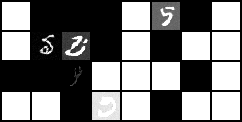

# [Paper](https://arxiv.org/pdf/2006.11239.pdf)
Diffusion models are parametrized markov chains, and the model learns the transitions.

The training algorithm is described as
1. Sample an image from the true distribution
2. Select t as an uniform number between 1 and T (T is the max step taken in the chain)
3. Sample noise from the gaussian with N(0, 1)
4. Loss is MSE of the the actual noise and our model predicted noise (Which is defined using a timestep function)

---

### Results of code

### Links

[What are Diffusion Models ?](https://lilianweng.github.io/posts/2021-07-11-diffusion-models/)

[The Annotated Diffusion Model](https://huggingface.co/blog/annotated-diffusion)

[Generating images with DDPMs: A PyTorch Implementation]( https://medium.com/mlearning-ai/enerating-images-with-ddpms-a-pytorch-implementation-cef5a2ba8cb1  )

---

### Reflections
Looks like I mostly implemented the algorithm and functions correctly, but should have bumped up the parameters for the model (the paper also mentioned they used u-net).

However, it's interesting that I was able to train gans on much smaller parameters. Reminds me of the meme I saw a yesterday https://twitter.com/untitled01ipynb/status/1618327756911312897

However, given that you have to construct a markow chain for 1000 steps, it's obvious that I should have beefed up the model. In addition to use layers like convolution more than linear layers. 

Another thing is the iteration speed, it took way to long to test the mode. Even though I rented GPU, it took time to train for multiple epochs, changing a small line, and retrain model.
-> This has to be improved.

Bugs that slowed down things a lot
- One bug was in one of the parameters causing the model to not convergence correctly.
- Another bug that hunted me typing `rand` instead of `randn`. Ton of debugging went into this silly bug!!!
