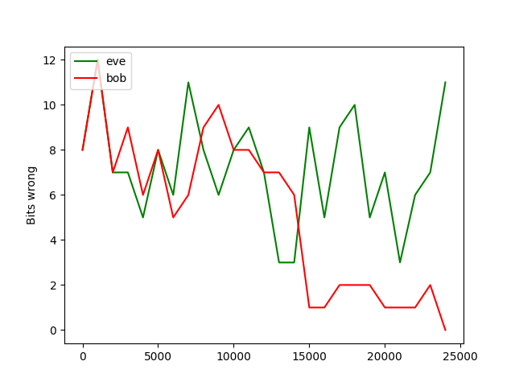

# [Learning to Protect Communications with Adversarial Neural Cryptography](https://arxiv.org/abs/1610.06918)

See example runs in `runs/`

Here is the best reconstruction error from the best run where Bob is able to decode Alice, and Eve is just confused.

