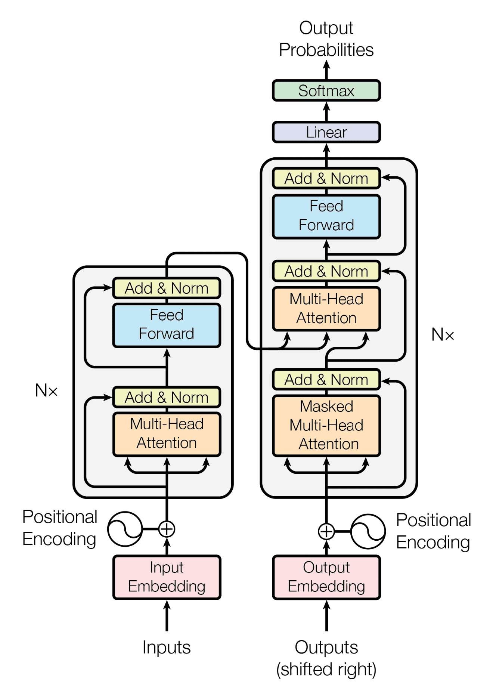
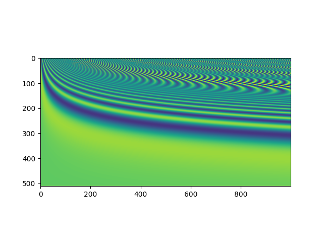
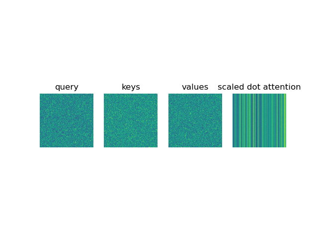
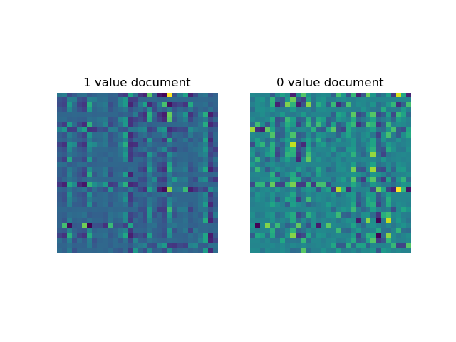

# Transformers

# The model
This is the model architecture as laid out in the original paper [Attention Is All You Need](https://arxiv.org/abs/1706.03762) 

## The encoder
So let's break down the layers
- `Input embeddings` is a traditional embedding layer
- `Positional encoding` is a way for the model to track the location of each of the words. Usually this is some kind of function, trigonometric functions like sin / cos is commonly used.
Example function from the attention paper is written in [PositionalEncoding.py](./PositionalEncoding.py) and visualized below. It is a sin / cos function

This is then fed into `N` identical layers. 
- The layers starts with a `Multi Head Attention` which is built up by the scaled dot-product attention mechanism. Which is written in [Attention.py](./Attention.py) and visualized below 

How does this transform into a Multi head attention ? Well you just scale up this method and have a model to learn the `Query`, `Key`, and `Value` fields (`nn.Linear(input_length, 3 * dimension)`). Example is in the [MultiHeadAttention.py](./MutliHeadAttention.py)

This is then fed into a feed forward network.
All layers also have a `layernorm(x + _layer(x))` by having residential connections.

## The decoder
The decoder is built with many of the same building blocks. It also have the `input embeddings`, `positional embeddings` and `N` of the same layer.
The decoder can only see past tokens, and not future tokens and therefore uses a small modification to the attention layer to mask out future values.
Then in the second layer uses the `Multi Head Attention` which is the same as the one used in the encoder. It also receives the keys and values output from the encoder, and queries from the previous decoder layer.
Then there is a final feed forward layer which in the same style as the encoder model.

## Other things to look at 
[https://uvadlc-notebooks.readthedocs.io/en/latest/tutorial_notebooks/tutorial6/Transformers_and_MHAttention.html](Tutorial 6: Transformers and Multi-Head Attention)
[Transformers know if it's training with dropout](https://colab.research.google.com/drive/1286r553N8drh6-VeZjZA1vbUBY9Z1fps?usp=sharing)

[Transformer’s Encoder-Decoder: Let’s Understand The Model Architecture](https://kikaben.com/transformers-encoder-decoder/)
[The Annotated Transformer](http://nlp.seas.harvard.edu/annotated-transformer/)
[https://github.com/gmontamat/poor-mans-transformers](https://github.com/gmontamat/poor-mans-transformers)
[https://github.com/karpathy/minGPT](https://github.com/karpathy/minGPT)
