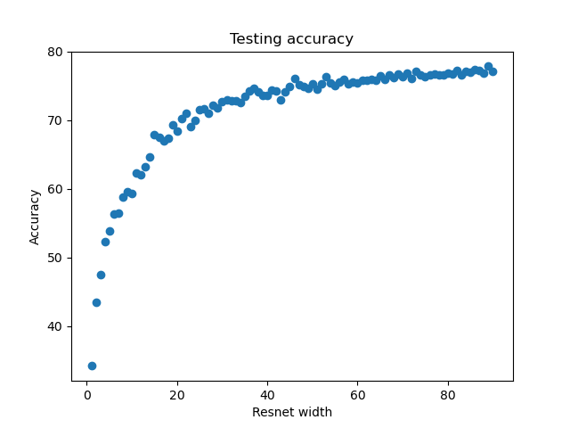
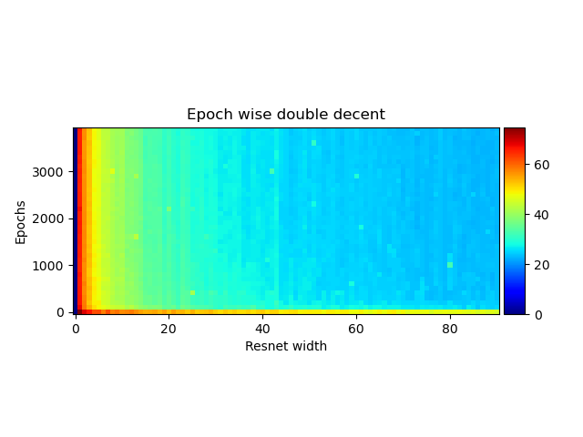

Trying to replicate some of the plots from [deep double descent: where bigger models and more data hurt](https://arxiv.org/pdf/1912.02292.pdf)

~~Currently the speed is 2 slow for 4K epochs :'(  need to investigate !~~ I tried various things, but looks like batch size increase was the [best approach](./notes.md) 

~~**TODO*: Train the models with the configs. Currently lambda has no available instances, it would be nice to have a 8GPU machine**~~
Lambda used to have 8 GPU instances for me, but no more :( ended up switching to vast.ai

### Results
The current results are without the label noise, since I don't see the same phenomena as OpenAI, I assume it might be a cause. The results are still interesting though. 

Only a subset of the width are trained currently namely 1,2, ..., 10, 12, 16, 32, 64, 128. More models are trained as we speak :) 

