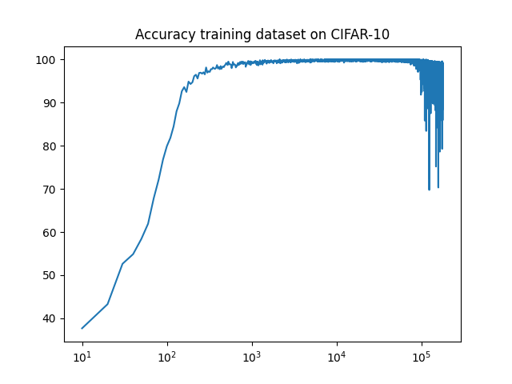
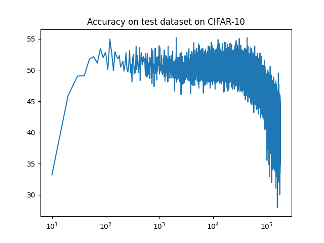

Partially inspired by [Generalization beyond overfiting on small algorithmic datasets](https://mathai-iclr.github.io/papers/papers/MATHAI_29_paper.pdf) which shows that long after overfitting the validation accuracy will sometimes go toward perfect generalization.

Did not find the same results as them (note that I trained on a different dataset), actually quite the opposite, suddenly the models get's confused and drops in accuracy. 
It's still interesting that this happens though, and the fact that it happens so late in the training.

Should rerun the experiment, but this time allow it to train for double so long, and see what happens.

