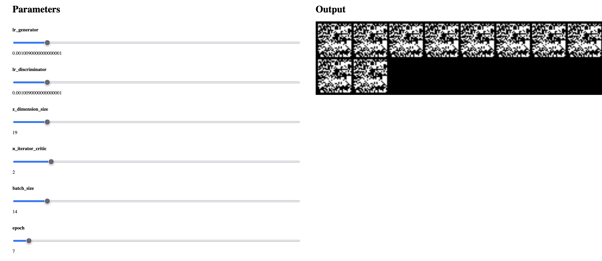

I want to see effect of learning rates etc on Gans.

## Known bugs
- Might be a bug in the parameter search scope  
- Update to have good example image of a gan producing good output

## Scope
- Parameter search of various ranges
- See gan output at epochs. We train for X epochs for each parameter
- Interactive ! 
  - Some simple sliders on epoch + parameters
  - Output should be the generated image at that stage.
