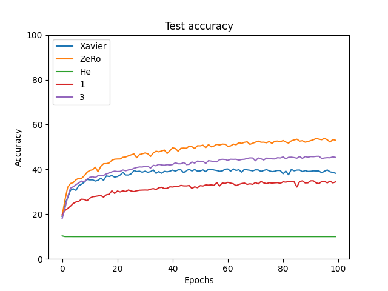
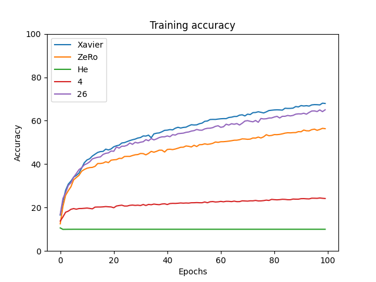

Small experiment to see effect of initialization on network convergence.

Looks like [ZerO](https://arxiv.org/abs/2110.12661) does quite well :)

Might update in the future with some more 
- (todo) Xavier Weight Initialization
- (todo) He Weight Initialization
- etc etc

