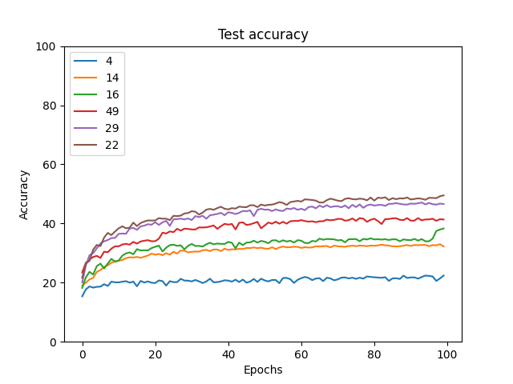

Small experiment to see effect of initialization on network convergence.

Looks like [ZerO](https://arxiv.org/abs/2110.12661) does quite well :)

It's also intresting how much variance you get in the test evaluation when you train the same network with random weights

