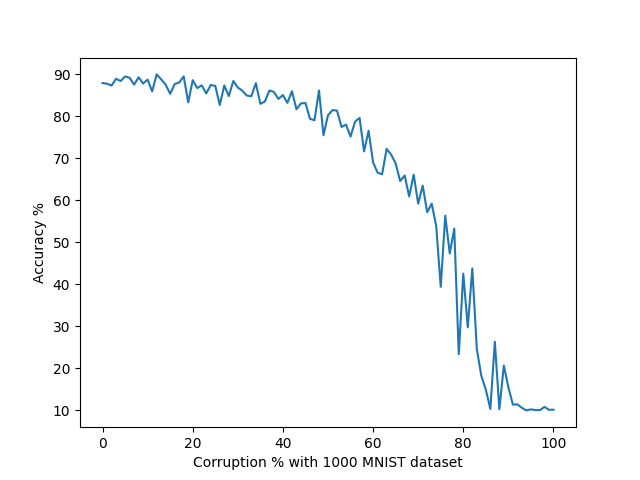
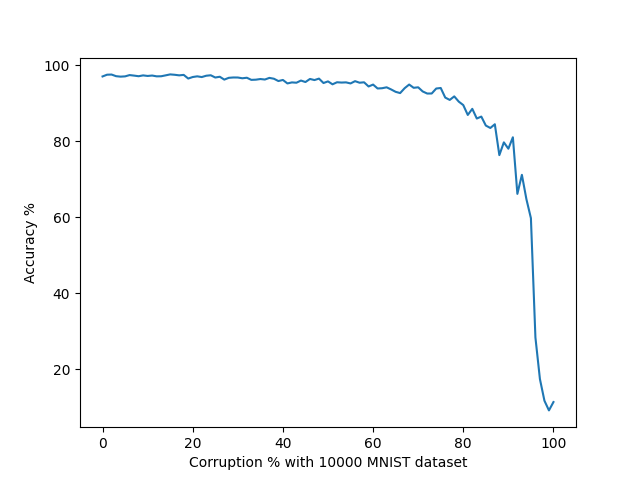

Randomly set a certain percentage of the dataset to a new random value, and evlauate the model on the test dataset. How much does the dataset need to be corrupt before you start to notice huge swings in the accuracy ?

# Results
Intresting to see how much more robuts having more data is to the same amount of corruption of the dataset

