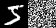
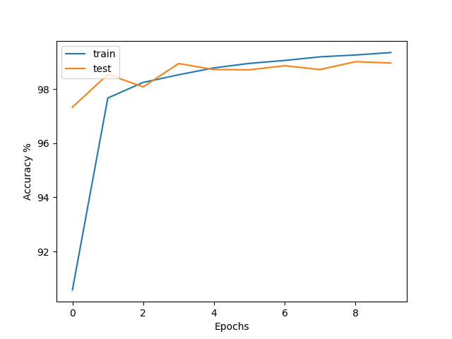

The idea I wrote down
```
Based on reading [Why do tree-based models still outperform deep learning on tabular data?](https://arxiv.org/pdf/2207.08815.pdf) they mentioned NNs are more affected by unimportant features. Create a small project to see if this is true. For instance by just padding some noise to an image vector maybe
```

Running the model with concat(mnist, random noise vector )




Interestingly the model does not care about the noise it seems

