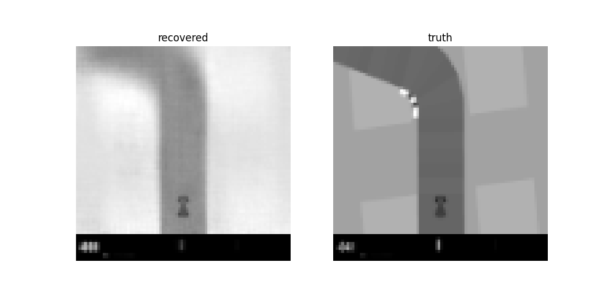

### [Mastering atari with discrete world models](https://arxiv.org/pdf/2010.02193.pdf)

Initial thought was that it reminded me of MuZero, but it is not actually that similar. Kinda a combination of VAE and MuZero.

See training run results [here](#Training-run-of-v1)

## Notes
Some key points
- Model is trained jointly with a component for representation, transition, image, reward, discounter. There is also a recurrent model. 

## World model
- representation model (part of the core model)
  - takes in the env image and the hidden state
  - outputs a latent state
- transition predictor (part of the core model)
  - tries to predict the current image without access to it (?)
  - it does it with only the recurrent layer
- Recurrent model (part of the core model)
  - Takes the last hidden state, representation and action
  - Outputs new hidden state (used in the other components)
-------
- image predictor
  - Input hidden state and image representation
  - *Used to train the representation* 
  - ^ they use a discrete space (one hot encoder, not floats)

## Actor critic
Works on the representation, not the actual env image. 

- reward predictor
  - Input hidden state and image representation
- discounter predictor
  - Input hidden state and image representation

The actor is actually trained to output the actions. The critic should output the value of the state. 

## Searching
- I think what is done is that the sequence model is used to search over all actions to create the search tree

## Loss
- Predicted image reconstruction
- Predicted reward and discounter
- Predicted 

## Tricks they use  (v3)
- categorical variables 
  - https://pytorch.org/docs/stable/distributions.html#onehotcategorical
- symlog

## Other links
- https://xlnwel.github.io/blog/reinforcement%20learning/DreamerV2/
- https://arxiv.org/pdf/1912.01603.pdf which is the v1 of the paper - best diagrams and explanations imo.
- https://arxiv.org/pdf/2010.02193.pdf v2 of the paper
  - 
- https://arxiv.org/pdf/2301.04104v1.pdf which is the v3 of the paper. 
- https://www.youtube.com/watch?v=vfpZu0R1s1Y v3 overview of the paper
- https://www.youtube.com/watch?v=o75ybZ-6Uu8 v2 overview of the paper 
- https://danijar.com/project/dreamerv2/
- https://www.youtube.com/watch?v=_e3BKzK6xD0 <- quick video from the authors, also good
- 

# Dreamer v1 
Big difference from newer version is that it does not use the GRU for memory. It only uses the latest observation.

General trick is to have the world model and use that to explore trajectories so that the actor critic don't need to interact with the real world.

## Training run of v1

Trained the encoder first. While the encoder is not perfect it is able to capture the most important part of the state. Namely location of the car in the road.

Having the world model solved, we train a actor critic. Looking at my logs I don't think this model is perfect, but it might be connected to the world model as I see the simulated reward seems to stay close to constant. 

One can see that agent suffer some from those defects, but is still able to work towards it goal on staying in the road and moving forward :) 
Even though it is a bit shaky and goes off (but recovers) towards the end, but note that this is entirely trained in "simulation" and there are definitely things that could be improved. This is mostly a poc of the paper :) 

<video width="320" height="240" controls>
  <source src="./readme/example_run.mp4" type="video/mp4">
</video>
