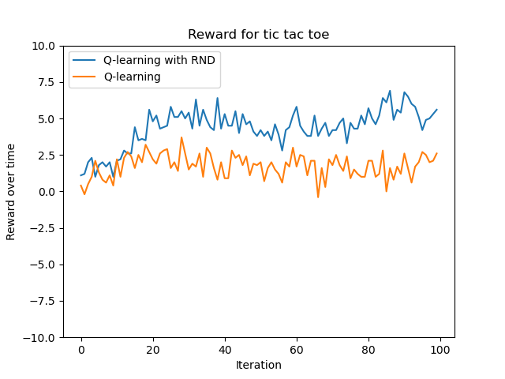

# [Curiosity-Driven Learning in RL](https://arxiv.org/pdf/1810.12894.pdf) 
Dicusses the idea of having an nerual network predict the output features of another neural netowrk (target network), and having that difference (MSE error) act as an exploration bonus.

*Exploration bonus?* 
Exploration bonuses is a way to deal with environments with sparse rewards( `e_{t}` ) by giving it a small bonus `i_{t}`so that the reward will be `r_{t} = e_{t} + i_{t}`. 

The goal is then to have `i_{t}` give out a reasonable number in states that are less frequent, and should be explored.

Some methods for exploration bonus used in the past is
- Count based  (how many times have you been here )
- Next state prediction (can you predict the next state)

*Some notes*
- The target network is never trained, it's has the seed random weights from start to finish, but the predictor network is trained

## Results

