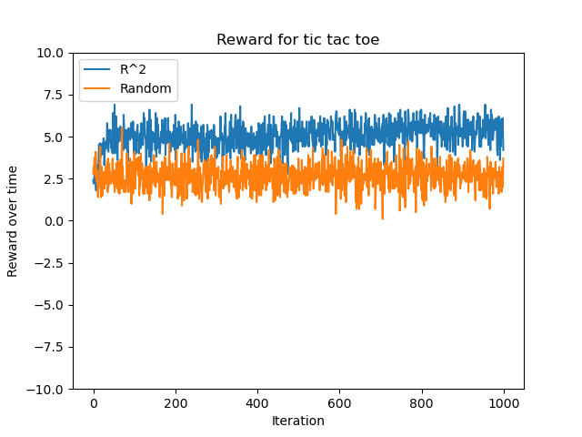

# [RL^2 - fast reinforcement learning via slow reinforcement learning](https://arxiv.org/pdf/1611.02779.pdf)
Idea is to learn a reinforcement learning within RNN weights using a (existing) RL method. In other words (and I quote the paper) learning a RL algorithm as a reinforcement learning problem 

The policy network is an RNN which receives the tuple `(state, action, reward, termination flag)`. How can it get the reward though ? 

Some other notes
- They use GRU to circumvent exploding gradients problems and output should be softmax.

## Results

