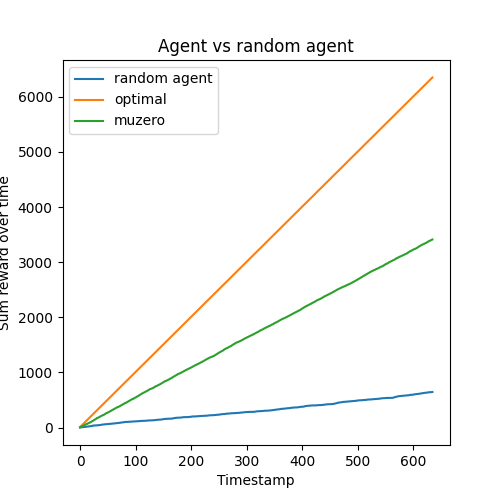

## [Mastering Atari, Go, Chess and Shogi by Planning with a Learned Model](https://arxiv.org/abs/1911.08265)



## TODO
- [ ] test model on more complex envs.

### Install 
```bash
pip install git+https://github.com/2xic-speedrun/optimization-utils.git
```
