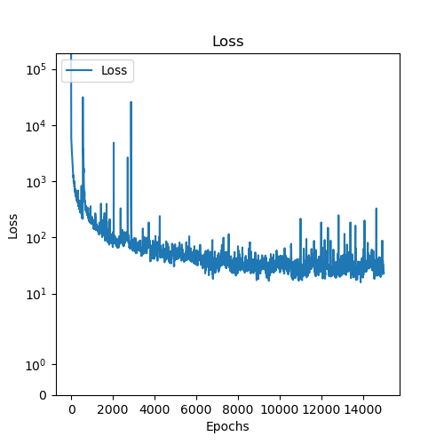
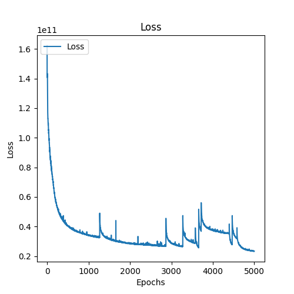
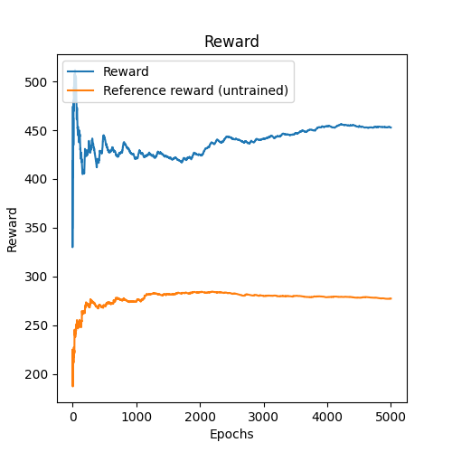
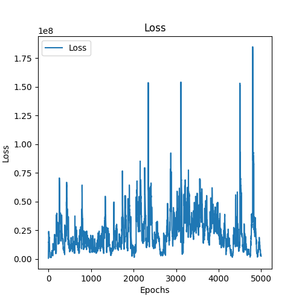

# Writeup Recurrent World Models Facilitate Policy Evolution

## paper notes
See [recurrent_world_models_facilitate_policy_evolution.md](./recurrent_world_models_facilitate_policy_evolution.md)

## setup

(it's for science)
```bash
pip install "gymnasium[atari]"
pip install gymnasium[accept-rom-license]
```

## Encoder
The job of the encoder is to learn the compressed representation. We can see from the image below that we are mostly able to do that, but the the reconstructed image is missing a few details.



| Input image                     | Vae reconstructed         |
| ------------------------------- | ------------------------- |
|  |  |

## Predictor
The job of the predictor is to learn the next predicted frame from the previous one + the action.



| Input image                                                     | Predicted                                                             | Truth                                                         |
| --------------------------------------------------------------- | --------------------------------------------------------------------- | ------------------------------------------------------------- |
|  |  |  |

## Agent
The agent uses the rnn state of the predictor and the compressed world view of the vae to do actions.
In the paper they used evolutionary algorithms, but I used DQN.

Plot below is the reward for the agent vs a random agent. 

  

You can see that the loss is unstable, so the model would likely improve by having a improved controller design (note again that I did not follow the design from the paper here).



## Some lesson learned
- Use the `batch_first` method for RNN, it's silly that this implementation was done without it
- Create simpler abstractions for speed early on. There was done a lot of optimization towards the end to speed up training, but this should have been done earlier IMO.
- Visualize everything 
  - There is likely information lost by the resizing of the image and the vae reconstruction. This probably contributed to the errors seen in the controller.
- I originally tried this for pong, but thought the env was to noisy to get the model working. This most likely wasn't the case, but if I did some more preprocessing it would likely have worked
- Being able to train models in isolation would have been nice. I could likely have kept training the encoder and started training the predictor while still improving the encoder in a separate process.
