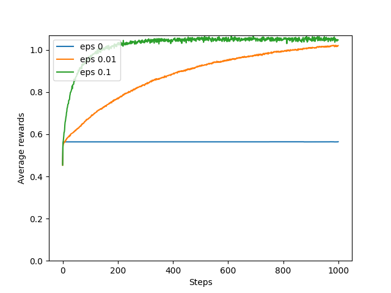
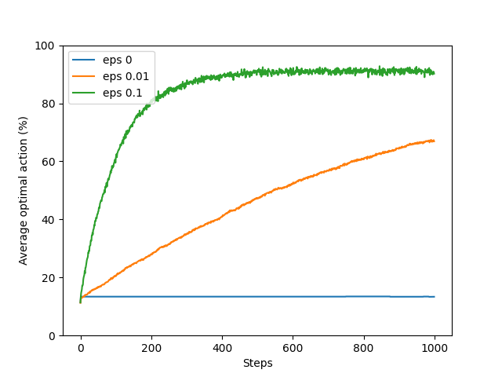
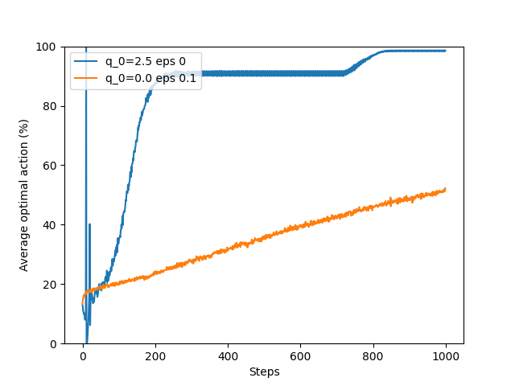
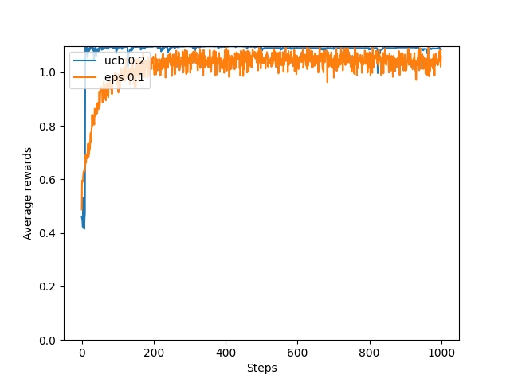
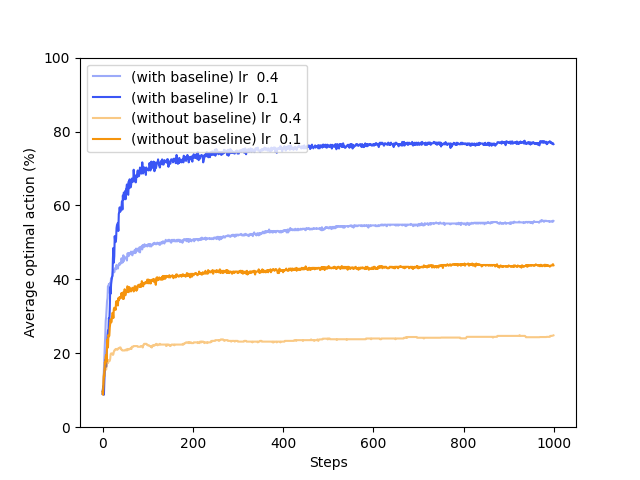
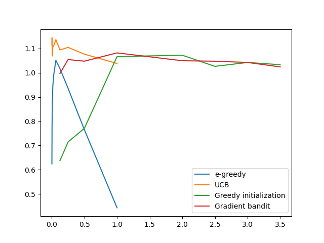

# Chapter 2 of the book

## Average performance of e-greedy

## optimistic initial value

## E-greedy vs Upper confidence 

## Greedy bandit

## Parameter study
This does not currently match well with the plot in the book, even though we come to the same results.

