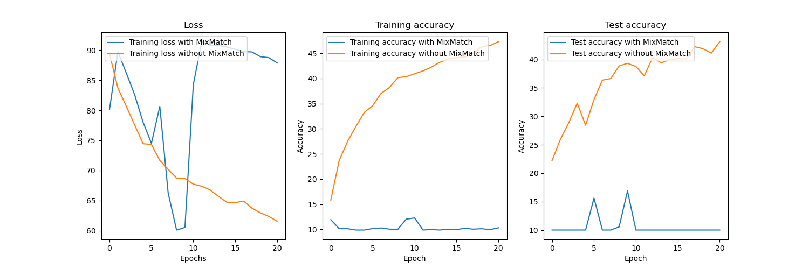

## [FixMatch](https://arxiv.org/abs/2001.07685)

### Summary
The core idea from the paper is by having consistency between strong and weak augmentation the model should also be able to learn the classes.