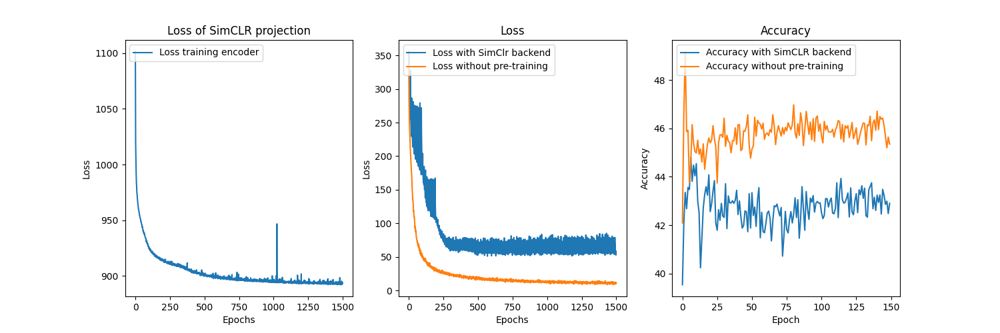

# [SimCLR](https://arxiv.org/abs/2002.05709)

Run the following to generate the plot and train the model 

```bash
python3 train_simclr_pytorch.py
```



## Reflection
- The loss was wrong and caused issue. This was not caught by the tests. Not good.  
  - Debugging against https://theaisummer.com/simclr/ helped find the bug.
