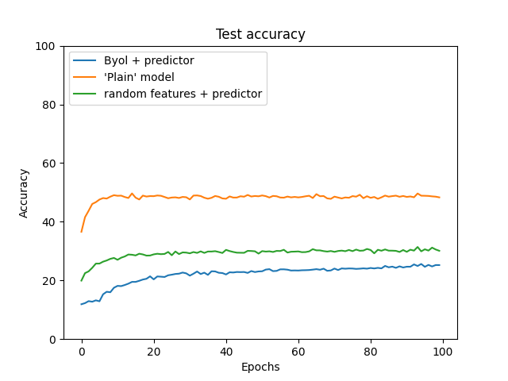

### [BYOL - Bootstrap Your Own Latent: A New Approach to Self-Supervised Learning](https://arxiv.org/pdf/2006.07733.pdf)

Core idea: BYOL is a an approach that uses two neural networks as a student an teacher. 
Given an augmented view of an image, the student should learn to predict the output of the teacher with a different view of the image.

### Accuracy
Something is wrong, BYOL should beat random weights.

### Loss 
Training loss of BYOL

